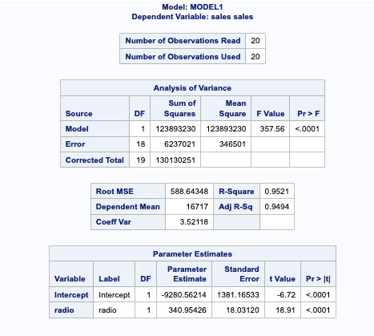

# SAS Example: Predicting Sales Using Historical Advertising Data
This project was was completed using the free [SAS University Edition](https://www.sas.com/en_us/software/university-edition.html) and was originally an assignment completed for the class MIS543 - Enterprise Performance Management as part of my coursework for the Masters in Data Analytics program at [CSU-Global](https://csuglobal.edu/graduate/masters-degrees/data-analytics).

## Project Overview

The example uses data for sales of a single product which was advertised using different mediums over the period of twenty months. The goal was to predict which advertising method: point of sale, radio, television, or newspaper, had the greatest correlation with increased sales. 

### STEP 1: IMPORT DATA

The data for this exercise was provided as a Microsoft Excel file, see [ad-sales.xlsx](ad-sales.xlsx) and was imported into SAS using the PROC IMPORT statement. 

```
PROC IMPORT datafile="/folders/myfolders/sasuser.v94/MIS543/M4/ad-sales.xlsx"
	dbms=xlsx
	out=MIS543.M4_PRODUCTSALESADVERTISING
	replace;
	getnames=yes;
RUN;
```

The SAS table created from the spreadsheet include the following columns: OBS (observation); SALES (number of sales); RADIO (amount spent of radio advertising); PAPER (amount spent on newspaper advertising); TV (amount spent on television advertising); and POS (amount spend on point of sale advertising). 


Next, summary statistics were created using PROC MEANS.

```
PROC MEANS; 
    VAR sales radio paper TV POS;
RUN;
```


See code file: [1.ImportData_SummaryStats.sas](1.ImportData_SummaryStats.sas)

### STEP 2: VISUALIZE DATA

To visualize data a scatterplot matrix was created using SAS's graphing utilities. 


See code file [2.ScatterPlotMatrix.sas](2.ScatterPlotMatrix.sas) 

### STEP 3: IDENTIFY CORRELATIONS 

Next, the correlation was tested between each advertising method and sales using the PROC CORR procedure.

```
PROC CORR data=MIS543.M4_PRODUCTSALESADVERTISING pearson nosimple noprob 
		plots=scatter(ellipse=prediction alpha=0.05);
	var radio paper TV POS;
	with sales;
RUN;
```


The Pearson Correlation test shows that both radio and TV have strong positive correlations with sales, while paper has a weak negative correlation, and POS shows a very weak overall relationship with sales. 

See code file: [3.CorrelationAnalysis.sas](3.CorrelationAnalysis.sas)

### STEP 4: PERFROM MULTIPLE REGRESSION

Multiple regression was then performed using the SAS Linear Regression model utility using backward selection. The model selection removed the television variable, indicating that radio advertising was the best predictor of sales. 


See code file: [4.MultipleLinearRegression.sas](4.MultipleLinearRegression.sas)


### STEP 5: CREATE A LINEAR REGRESSION MODEL 

Finally a simple linear regression model was produced using the PROC REG method to predict sales from radio advertising. 

```
PROC REG data=MIS543.M4_PRODUCTSALESADVERTISING alpha=0.05 
		plots(only)=(diagnostics fitplot);
	model sales=radio /;
	RUN;
```



The results or the model show a statistically significant linear relationship (p < 0.0001) and an adjusted R-Sq value of 0.9494. The fit plot visualizes the strong positive linear relationship between the independent variable radio and the dependent variable sales.

See code file: [5.LinearRegression_SalesRadio.sas](5.LinearRegression_SalesRadio.sas)

## Summary

First, data was imported from the spreadsheet and descriptive statistics were produced. Second.... to understand the characteristics of each variable within the dataset. Second, correlation analysis was performed to identify the direction and strength of the linear relationships between each type of advertising medium and sales. Third, regression analysis was performed for the variables with had linear relationships with sales. Finally a regression equation was constructed from the model results which could be used to predict future sales based on different independent variable values.

